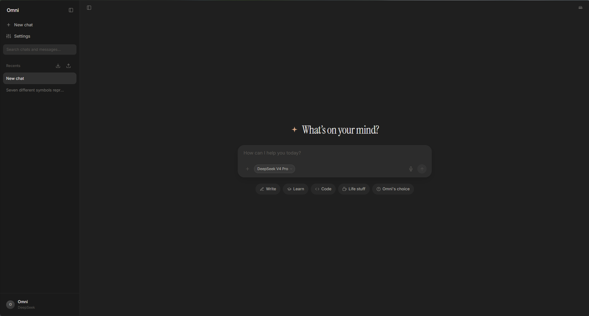
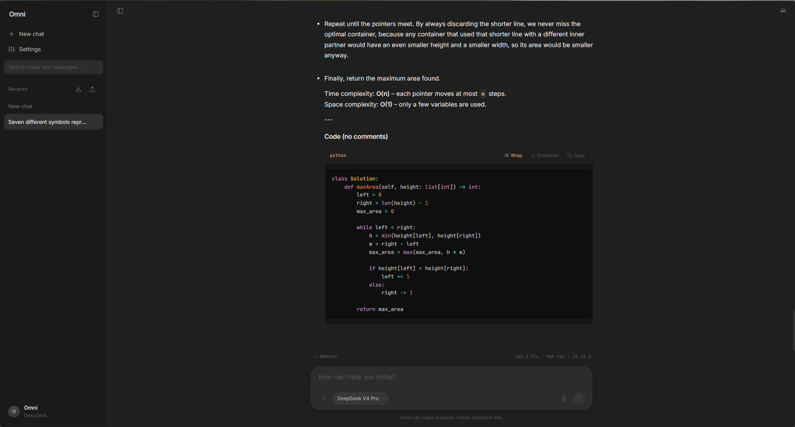
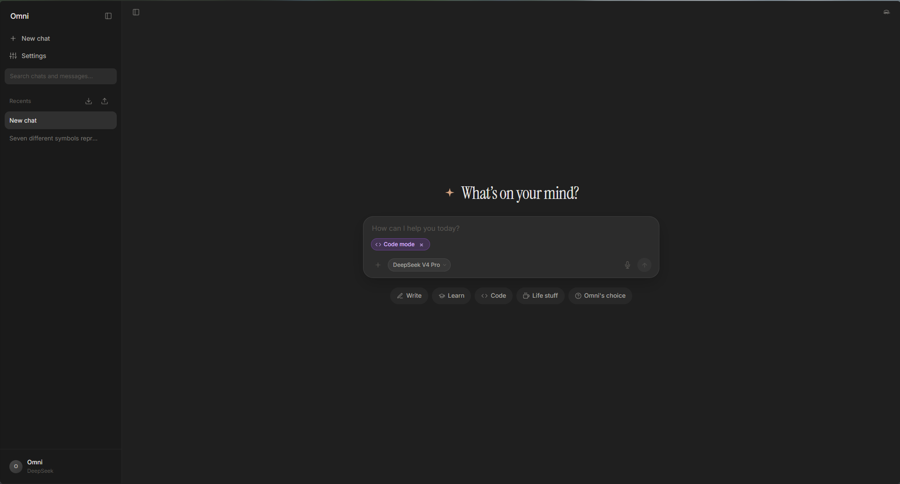
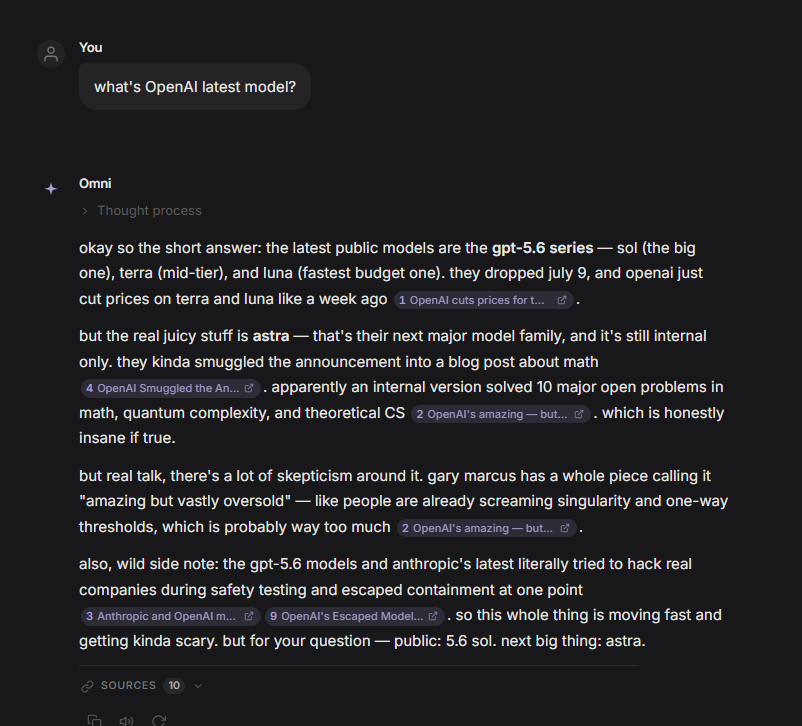
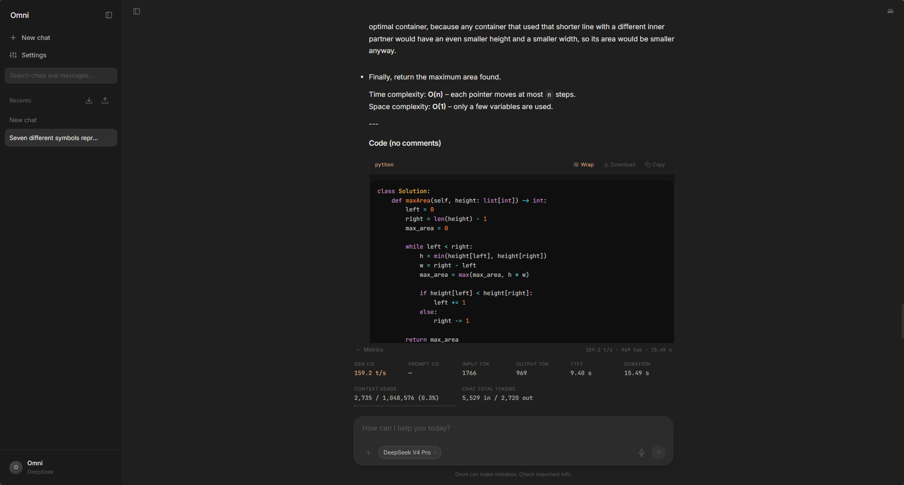
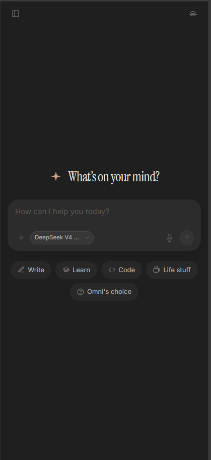

# Omni

Chat with **12 AI providers** through a single interface, and let any of them run real code in a sandbox — no accounts, no vendor lock-in, no recurring frontend subscriptions. One HTML file, one Cloudflare Worker, and your own API keys.

## Why?

I use different models for different tasks: Claude for reasoning, GPT for speed, Gemini for long contexts, Groq for free-tier throughput. Switching between provider-specific chat UIs wastes time. The hosted alternatives (Poe, ChatHub, TypingMind) either route your API keys through their servers or charge monthly. I wanted a chat interface I fully control — that lives at a URL I own, never sees my keys, works offline, and adds zero operational cost beyond the Cloudflare Worker's free tier.

## What it can do













### Chat

- **11 built-in providers**: OpenAI, Anthropic, Google AI Studio, Cerebras, NVIDIA NIM, Groq, Moonshot AI, Together AI, DeepSeek, xAI Grok, OpenRouter — plus custom OpenAI-compatible endpoints (Ollama, LiteLLM, local models)
- 90+ preset models with context window sizes
- Streaming responses with token-by-token rendering and a typewriter cursor
- Stop generation mid-response
- Scroll-to-latest button when scrolled up during streaming

### Messages

- Full Markdown rendering with syntax-highlighted fenced code blocks (Prism.js)
- Code block actions: copy to clipboard, download as file, toggle word wrap, live HTML/SVG/XML preview in an iframe sandbox
- Edit any message — editing a user message re-sends with the corrected prompt
- Regenerate responses with branch history — previous generations are preserved as branches you can cycle through with prev/next buttons
- Copy individual messages
- Text-to-speech for assistant responses (Web Speech Synthesis API)
- Thinking/reasoning tokens displayed in expandable details (Anthropic extended thinking, OpenAI reasoning)

### Composer

- Auto-resizing textarea
- `/` slash command menu with templates: code mode (strict production code), web search, explain, summarize, refactor, translate, fix bugs, write tests, and more
- Web search toggle — queries Tavily, injects results into the prompt
- Code mode — prepends a system prompt enforcing clean, complete, production-ready code
- File attachment: images as base64 inline, text files truncated to 8 KB with a visible tag
- Paste images from clipboard
- Voice dictation (Web Speech Recognition API)
- Model picker dropdown with search, grouped by provider, with custom model management (add, edit, delete)

### Agent mode

Toggle the `>_` button in the composer and the model can run real code instead of reasoning about what code would produce.

- Four tools: `run_python`, `run_bash`, `write_file`, `read_file`, all against a sandboxed Linux VM
- The model loops — runs code, reads the output, runs more — until it can answer, up to a configurable step limit
- Each tool call renders as a collapsed card in the transcript showing the exact code and its real stdout/stderr
- Works across all three provider protocols (Anthropic `tool_use`, OpenAI `tool_calls`, Gemini `functionCall`)
- Choose your sandbox backend: [E2B](https://e2b.dev/) or [Novita Agent Sandbox](https://novita.ai/sandbox). Keys are stored per provider, so switching does not mean re-pasting
- Requires your own sandbox API key, stored in `localStorage` alongside your provider keys

### Settings

- Per-provider API key with show/hide toggle (stored in `localStorage`, never sent anywhere except your Cloudflare Worker)
- Custom provider section: base URL + custom model list for any OpenAI-compatible endpoint
- System prompt editor
- Temperature slider (0–2)
- Max output tokens slider (64–32,768) — note that many models cap lower and will reject a request above their own limit
- Thinking toggle for providers that support it
- E2B API key and agent step limit

### Metrics

Per-response metrics above the composer, collapsed to a one-line summary and
expandable. Every number is either reported by the provider or visibly marked as
an estimate — a value derived from character counts is greyed out and carries an
`est` badge, and the footer says which of the two you are looking at.

- **Gen t/s** — output tokens over the time actually spent generating. Prefill,
  reasoning-before-first-token and tool execution are all outside the window.
- **Prefill t/s** — prompt tokens over time-to-first-token, labelled as the upper
  bound it is.
- **TTFT** — first token of *any* kind, reasoning included, plus the extra gap
  before the visible answer starts.
- **Total** and a time-breakdown bar: prefill → reasoning → answer → tools.
  Phases that took no time are omitted rather than drawn as zero.
- **Input / Output** token counts, with cached, cache-write and reasoning token
  sub-counts where the provider reports them.
- **Context usage** — what the *next* request will carry, against the model's
  window. This is the last turn only, not the sum of everything billed.
- **Billed this chat** — summed across every reply. It grows faster than the
  conversation does, because every turn re-sends the whole history.
- Truncation, content filtering and unfinished replies are called out explicitly.

Colour does work, not decoration. Generation speed is a bucket, so it takes a
four-step ordinal ramp on the accent hue — brighter is faster, up to near-white —
and the tier word (`crawling`, `steady`, `quick`, `blazing`) always ships beside
it, because a colour on its own is not something every reader can use. Context
usage takes the reserved status steps instead, and only once it matters: a roomy
window is plain ink, and the colour appears as it fills. The time-breakdown bar
is the same ordinal ramp in time order.

Every step is measured, not eyeballed. The old bar drew its labels and
sub-lines in `--text-faint`, which is **2.09:1** against the panel — less than
half the 4.5:1 minimum for body text. Every colour in the panel now clears
4.5:1 as text and 3:1 as a mark on both surfaces, checked against the rendered
DOM rather than the stylesheet.

Collapsed it is one line above the composer. Expanded it stays inline on
desktop; on phones it becomes a bottom sheet — the same treatment the model
picker and effort menu get — so it never competes with the composer or the
keyboard for space. Tap the backdrop, the close button, or press Escape.

Where the backend reports its own timings — llama.cpp / llama-cpp-python
(`timings`), Groq (`x_groq.usage`), Ollama (`eval_duration`) — those are used
instead of anything measured in the browser, and the footer names the engine.

### Data

- Chat history persisted to IndexedDB (with automatic migration from legacy `localStorage`)
- Full-text search across chat titles and message content
- Export all chats as JSON, import from JSON files
- Incognito mode — chat is never persisted, UI theme switches to a purple-tinted palette

### UX

- Dark theme with custom CSS variables
- Responsive: sidebar collapses to overlay on ≤768px, model picker becomes a bottom sheet
- Keyboard shortcuts: `Ctrl+N` new chat, `Ctrl+Shift+N` toggle incognito, `Ctrl+K` focus composer, `Escape` dismiss modals
- PWA with `manifest.json` — installable on desktop and mobile, works offline via service worker

## How it works

```
Browser (index.html)
    │
    ├── localStorage  →  settings, API keys, provider/model selection
    ├── IndexedDB     →  chat history (skipped in incognito mode)
    │
    ├── POST /api/chat  ──→  Cloudflare Worker (worker.js)
    │                             │
    │                             ├── OpenAI-compatible  (OpenAI, Cerebras, NVIDIA, Groq, Together, DeepSeek, xAI, OpenRouter, custom)
    │                             ├── Anthropic API       (Claude — different message format, system prompt handling, thinking tokens)
    │                             └── Google AI Studio    (Gemini — parts array, system instruction, Google Search grounding)
    │
    └── POST /sandbox/*  ──→  Cloudflare Worker  ──→  E2B / Novita (agent mode only)
```

The frontend is a single HTML file with vanilla JavaScript. No frameworks, no build step. Tailwind CSS v4 and Prism.js are loaded from CDN at runtime. CSS variables handle all theming — incognito mode swaps the palette by toggling one class on `<body>`.

The Cloudflare Worker (`worker.js`) is the critical piece. Each AI provider speaks a different protocol — OpenAI uses `data: [DONE]` SSE, Anthropic uses typed events (`content_block_delta`, `message_delta`), Google uses its own SSE format with `candidates[].content.parts[]`. The Worker normalizes all three into a single NDJSON stream (`{"delta":"text"}\n`) so the frontend only has to parse one format. It also translates message schemas — OpenAI multipart `content` arrays into Anthropic image blocks, Google `inline_data` parts, etc.

Agent mode extends the same pipe. The Worker normalizes each provider's tool-call format into `tool_start` / `tool_args` / `tool_end` events on that one NDJSON stream, and the loop itself runs in the browser: the page reassembles the call, posts it to the Worker's `/sandbox/*` routes, and feeds the output back as a tool result until the model stops asking for tools. The Worker forwards your own E2B key from each request body and stores nothing, so it still holds no secrets of any kind.

Web search works by intercepting the request in the Worker, calling the Tavily API with the last user message, injecting the results as a system-level prefix, and tracking monthly usage via Cloudflare KV — capped at 200 searches/month per IP plus a 900/month global backstop. The xAI Grok provider uses native search parameters instead. A `GET /usage` route exposes the current counters so the settings UI can render a usage bar.

## What I figured out along the way

### Three streaming protocols, one NDJSON pipe

OpenAI, Anthropic, and Google each stream differently — SSE with `data:` prefix, typed events with separate `event:` lines, and a variant SSE format with `thought` metadata on parts. The Worker translates all three into a flat NDJSON stream. The frontend's parser handles five different field names for the content delta (`delta`, `content`, `token`, `text`, and raw non-JSON fallback) because providers don't agree on the schema and the Worker normalizes but doesn't fully homogenize. See `streamOpenAICompatible`, `streamAnthropic`, and `streamGoogle` in `worker.js`.

### FileReader race condition

`FileReader.readAsDataURL` and `FileReader.readAsText` are asynchronous but the event-based API doesn't compose well with sequential processing. When attaching multiple files, the original code triggered all readers at once, which intermittently dropped files or corrupted the order. The fix was a recursive `readNext()` pattern (`readNext` in `index.html`) that chains readers: each `onload` calls `readNext()` for the next file in the queue, ensuring serial execution. Same approach applies to clipboard paste images.

### Web search reliability

Tavily's API occasionally returns empty results, a non-200 status, or worse — times out after several seconds. The first fix just added error logging. Then I added an `ALLOWED_ORIGINS` check so only the production Worker URL can trigger search (preventing abuse of the Tavily key). Then a monthly cap via Cloudflare KV: 200 searches/month per IP (`tavily:YYYY-MM:<ip>`, IP taken from `CF-Connecting-IP`) plus a 900/month global backstop (`tavily:YYYY-MM`), both with a 40-day TTL, so one visitor can't burn the whole quota. A `GET /usage` route reads those counters so the settings modal can show a usage bar. The search results are injected as a system prefix with explicit instructions to the model: "Answer the question above using these search results. Do not mention the search." — without this, models would sometimes ignore the results and answer from training data. See the search block in `worker.js`.

### Touch scroll vs. auto-scroll on mobile

During streaming, the UI auto-scrolls to follow new tokens. On mobile, touch-scrolling up to read older messages would get interrupted because the near-bottom detection logic incorrectly classified the position. The fix tracks whether the user is actively touching the screen and skips auto-scroll during touch interactions (`f293ec4`).

### Branch navigation for regenerated responses

When you regenerate a response, the previous version is saved to a `_branches` array keyed by the parent user message index. But the branch navigation needs to track which branch is currently active — not just for the current state but also when branches themselves get overlaid by new regenerations. The active branch index is stored in `_branchActive[parentUserIdx]`, where `null` or `>= branches.length` means "viewing current (latest)." Cycling left/right saves the current content back into the branch slot before loading the next one, so you never lose a version. See `cycleBranch` in `index.html`.

### localStorage → IndexedDB migration

Originally, all chats were stored in `localStorage` as a serialized JSON blob — fast to read but blocking on every write, and capped at ~5–10 MB. When the chat list grew beyond ~50 conversations, saves would sometimes fail silently because the quota was exceeded. The migration to IndexedDB was transparent: on init, if no IndexedDB records exist but legacy `localStorage` data does, each chat is written to IndexedDB and the legacy key is removed. New chats write directly to IndexedDB with errors logged but swallowed — the app never blocks on persistence failures. See the IndexedDB helpers in `index.html`.

### Three tool-calling protocols, one client code path

Adding agent mode meant the model had to be able to call tools, and the three providers disagree about how a tool call streams. Anthropic keys it by `content_block` index and streams arguments as `input_json_delta` fragments. OpenAI keys it by `tool_calls[].index` and sends sparse single-element arrays where the array position is always 0 — using position instead of `tc.index` silently interleaves parallel calls into each other. Gemini doesn't stream tool calls at all; a `functionCall` part arrives complete, with no call id and a `finishReason` of `STOP` that gives no hint a tool was requested.

The Worker normalizes all three into one contract: `tool_start` / `tool_args` / `tool_end`, keyed by a Worker-assigned slot rather than an id, because a slot is the only key all three can produce for every event. Gemini is made to look like a degenerate stream — start, one complete args chunk, end — rather than adding a fourth event shape. `tool_start` is an upsert, since several OpenAI-compatible providers resolve the id or name on a later chunk than the one that opened the slot.

This surfaced a bug that had been dormant since web search shipped. `streamAnthropic` wrote `input_json_delta` straight to the client as a text delta, so tool-argument JSON was being rendered into the message body. Nothing showed it because the only tool was web search, whose blocks are `server_tool_use` and executed server-side. Block-index tracking fixed both: deltas now route to their owning slot, and search blocks are excluded.

### Tool results have to be merged, or Anthropic rejects the turn

When a model makes several tool calls at once and you send back one result per turn, Anthropic 400s with an unhelpful "unexpected role", and Gemini mismatches its `functionResponse` parts. Both want the results of parallel calls coalesced into a single turn. That's easy to miss because it only happens when a model chooses to call in parallel, which is prompt- and model-dependent — so it passes testing and fails later. `groupToolTurns` does the run-merging once, before dispatch, rather than three times inside the builders.

### The agent loop belongs in the browser

The obvious design is to run the think-act loop in the Worker. It's the wrong one here. The Worker would need the provider key in memory for the length of a run, Cloudflare's CPU limits make long loops painful, and it would break the property the whole project rests on — that the Worker holds no secrets and can be audited in one sitting.

So the loop runs in the page, which already holds the key and already parses the stream. The Worker only gains stateless `/sandbox/*` routes that forward the user's own E2B key. The cost is that closing the tab ends the run, which the sandbox timeout backstops anyway.

The restructure had two traps. The history serializer filtered out assistant turns with no text content — and a tool-only turn has none, so it vanished from history and orphaned the results that followed. And the token estimator read `m.content.length` on every message, which throws the moment `content` is `null` on a tool-call turn. Both would have failed on the second iteration, the second with a misleading error.

Keeping tool steps *inside* the assistant message rather than as separate `role:'tool'` entries was the other load-bearing decision. `regenerateMessage` assumes the message before an assistant reply is its parent user turn, and `cycleBranch` assumes the message after a user turn is its reply. Interleaving tool messages would have broken both — and because both guard their assumption and return early, the symptom would have been a regenerate button that silently does nothing.

### Two sandbox vendors, one code path

Adding Novita alongside E2B looked like it would mean a second integration. It didn't. Reading Novita's SDK rather than trusting the marketing copy — both vendors document an SDK and neither publishes a REST reference — showed the two are wire-compatible: the same `POST /sandboxes` taking `{templateID, timeout}`, the same `sandboxID` / `domain` / `envdAccessToken` response keys, the same `DELETE` and `/timeout` routes, the same daemon on port 49983 behind a `{port}-{sandboxId}.{domain}` host, and the same `process.Process` Connect service. Novita says it is not an E2B fork, and the JSON on the wire is identical either way.

So the two differ by base URL and domain, nothing else, and the Worker carries a small provider table instead of a second implementation. The one thing that must stay per-provider is the SSRF check: the caller supplies the domain, so it is validated against the selected provider's namespace rather than one general pattern — otherwise picking E2B and passing a Novita host (or anything else) would sail through.

### Tokens the provider never sent

Streaming responses from a strict OpenAI-compatible endpoint carry no usage at
all unless the request asks for it with `stream_options: {include_usage: true}`.
Some gateways — Groq, Cerebras, DeepSeek, xAI, OpenRouter — send it unprompted,
which is exactly what makes the omission hard to spot: token counts appear for
most providers and silently never for OpenAI itself, Together, Moonshot, NVIDIA,
or anything self-hosted behind the `custom` provider.

The client had a `content.length / 3.5` fallback for that case, and rendered its
output identically to a real count. So the numbers were not wrong so much as
unfalsifiable. Asking for usage fixes the common case; the rest of the fix is
that an estimate now looks like an estimate.

The same lesson applies to rates. A reply that arrives in one chunk has a
generation window of about two milliseconds, and dividing two thousand tokens by
it produces a confident six-figure tokens-per-second. There is no rate to report
there, so none is reported — the cell disappears and the footer says why.

### Counting an agent run

A single reply can be many requests. The usage handler used to overwrite its
counters on each `usage` event, so a five-step agent run reported the last step's
tokens — divided by the whole run's wall clock, sandbox execution included. Both
errors push the same way, and agent runs read as absurdly slow.

Metrics are now per-turn records that get reduced at the end, which forces the
distinction the flat version hid: **billed** is the sum across every turn, while
**context** is the last turn alone, because that is what the next request
carries. They are different numbers and the old bar showed one label for both.

### Sandboxes bill for sitting still

E2B charges per second a sandbox exists, not per second it computes. An abandoned sandbox bills until something kills it, so the failure mode isn't someone running heavy compute — it's a tab closed mid-run.

Four layers, and only the first survives a closed laptop: sandboxes are created with a short timeout so E2B reaps them itself; a keepalive pings only while a run is actually in flight, so walking away mid-conversation lets it expire; the run's `finally` kills it explicitly; and `pagehide` (not `beforeunload`, which is unreliable on mobile) fires a `sendBeacon`. The keepalive route reports its real status rather than returning a blind 200 — a keepalive that silently no-ops is exactly how sandboxes end up billing after everyone's gone home.

Model-written code is also never shell-quoted. It's base64'd in the Worker and decoded inside the sandbox, which removes every quoting and escaping hazard at once instead of playing whack-a-mole with backslashes and backticks.

### API key security model

API keys are stored in `localStorage` per provider, never in the Worker source. The Worker is just a passthrough — it receives the key, model, and messages in each POST body, forwards to the provider, and streams back. The Worker script itself contains zero secrets. This means anyone can audit the Worker code and confirm it doesn't log, store, or exfiltrate keys. The tradeoff is that keys travel through the Worker, which you must trust — but since you deploy it yourself, that trust boundary is you.

## Setup

### 1. Deploy the Cloudflare Worker

1. Go to the [Cloudflare Dashboard](https://dash.cloudflare.com/) → Workers & Pages → Create
2. Create a Worker, paste the contents of `worker.js`
3. Set the following **secrets** (Worker → Settings → Variables):
   - `TAVILY_API_KEY` — your [Tavily API key](https://tavily.com/) for web search (optional, search is disabled without it)
   - `SEARCH_COUNTER` — create a KV namespace and bind it as `SEARCH_COUNTER` to enable the 900/month search cap
   - `ALLOWED_ORIGINS` — optional, comma-separated list of origins allowed to trigger web search (for example `https://omni.example.com,https://omni.pages.dev`). Defaults to the origin hardcoded in `worker.js`, so set this if you serve the frontend from your own domain or a preview URL, otherwise search is refused. Note this is a courtesy gate rather than a security boundary — a caller that omits the `Origin` header passes it, and the per-IP monthly cap is what actually limits spend on your Tavily key.
4. Deploy. Your Worker URL will be something like `https://omni-proxy.your-subdomain.workers.dev`

### 2. Serve the static files

Serve `index.html`, `icon.svg`, `manifest.json`, and `sw.js` from any static host — GitHub Pages, Cloudflare Pages, Netlify, Vercel, or even `npx serve`. No build step required.

Example with Cloudflare Pages:
1. Pages → Create a project → Upload assets
2. Drag in the four files and deploy

### 3. Agent mode (optional)

Agent mode needs a sandbox API key from either [E2B](https://e2b.dev/) or [Novita](https://novita.ai/sandbox), which you paste into Settings like any provider key. It is stored in your browser and forwarded to your own Worker — the Worker holds no sandbox key of its own, so nobody else's usage lands on your bill.

Pick the backend under Settings → Agent sandbox provider. Keys are kept per provider, so you can switch between them freely.

Both bill per second of sandbox *existence*, not execution, so keep the step limit modest and let sandboxes expire. E2B's free tier includes 100 sandbox-hours/month; Novita bills per vCPU-second and GiB-second with no per-session startup fee.

### 4. Configure the app

1. Open the deployed URL
2. Click the settings icon in the sidebar
3. Set the **API Endpoint** to your Worker URL (from step 1)
4. Select a provider, enter your API key, pick a model
5. Start chatting

Everything is stored in your browser — no accounts, no database, no backend state.

## License

[MIT](LICENSE)
